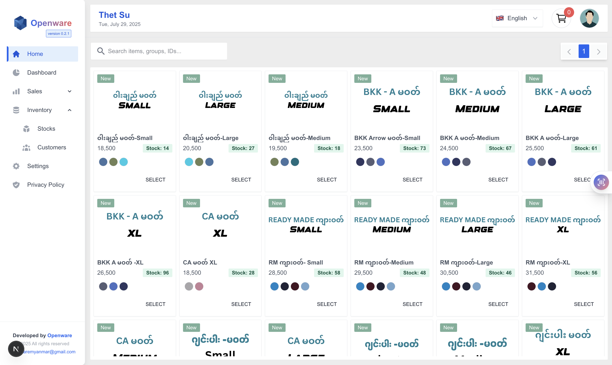
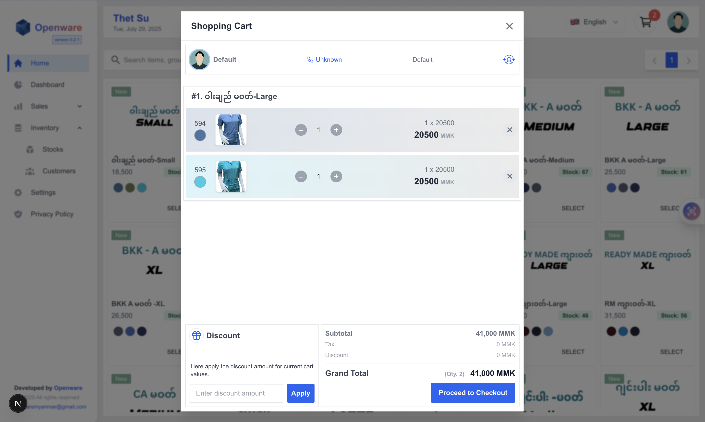
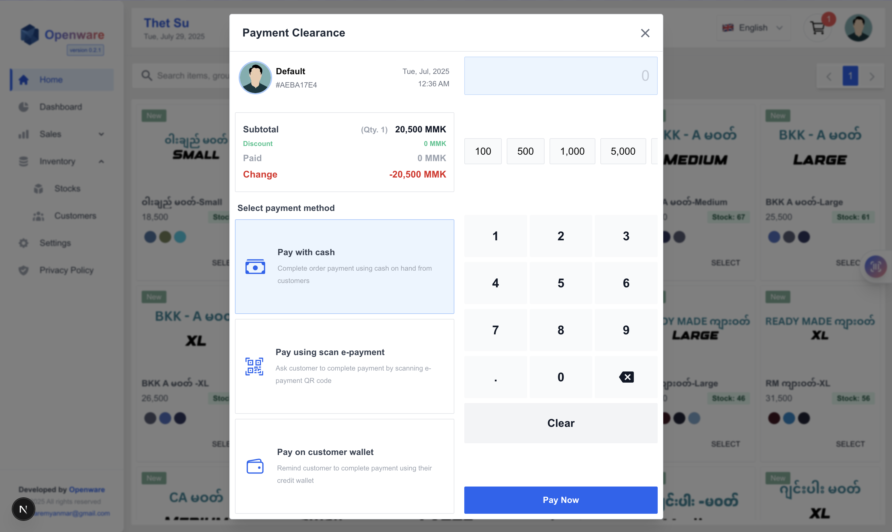
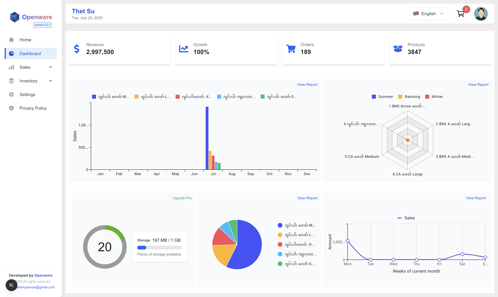
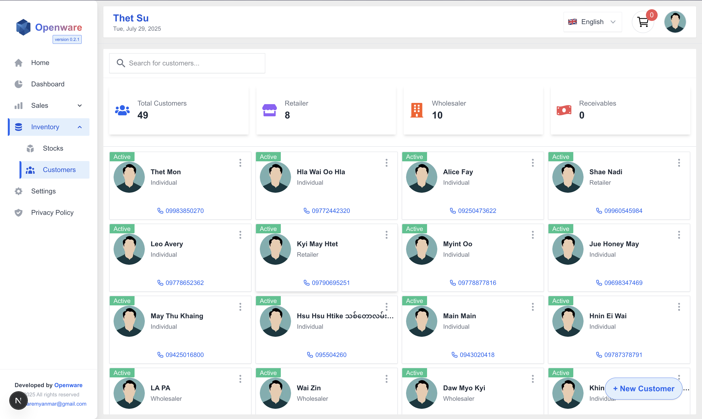
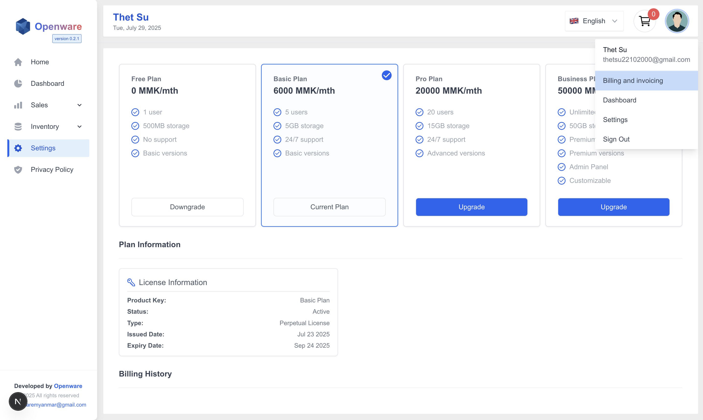
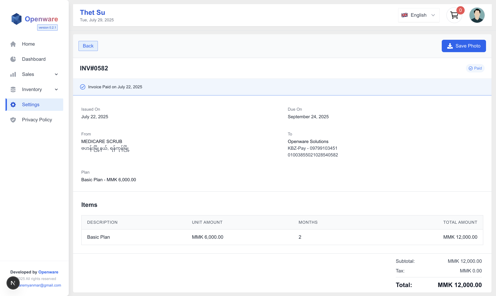
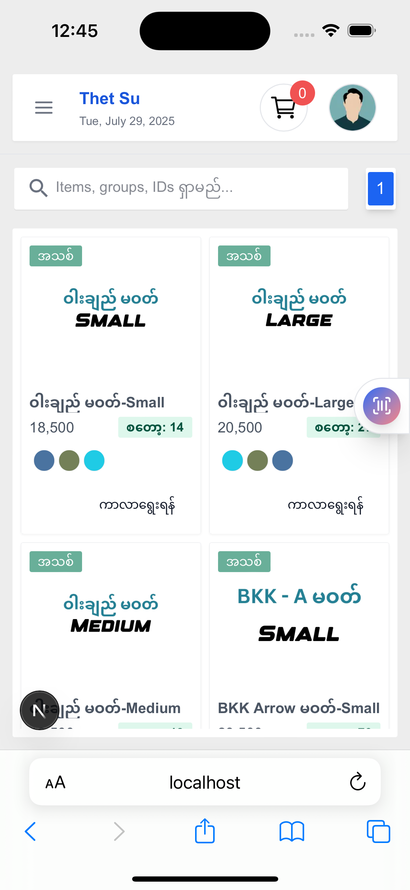
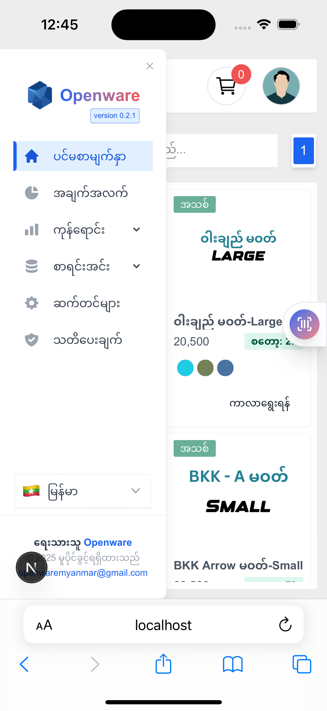
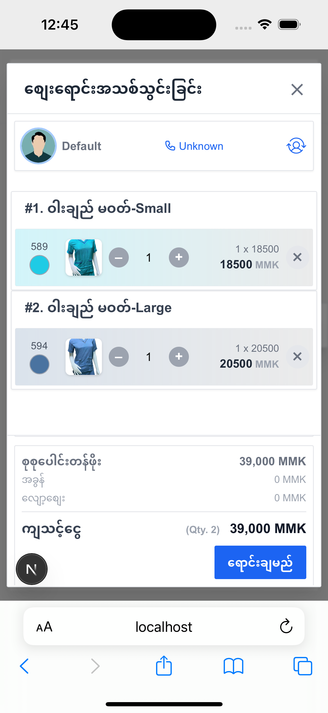

<p align="center">
  
</p>

# Openware Inventory Management System

> A production-ready multi-tenant POS-inspired inventory management web app, powered by **Next.js**, **Spring Boot**, and **PostgreSQL**, built for modern retail operations in Myanmar and beyond.

---

## 🧰 Tech Stack

### 🖥️ Frontend

- **Next.js 15**
- **React 18**
- **Zustand** – Lightweight state management
- **Tailwind CSS** – Utility-first responsive styling
- **Supabase Auth & Storage** – Authentication and media hosting
- **Lucide & ShadCN/UI** – Accessible, elegant UI components

### ⚙️ Backend

- **Spring Boot (Java 17+)**
- **Spring Security + JWT** – Authentication & role-based access
- **Spring Data JPA + Hibernate** – ORM and efficient DB access
- **PostgreSQL** (via **Aiven Free Tier**) – Scalable relational database
- **Stored Procedures & SQL Functions** – For analytical reports and dashboards
- **Database Triggers** – Auto-delete logic for stock items
- **Supabase Object Storage** – For secure image & file uploads

---

## 📐 Architecture Overview

The Openware Stock Manager follows a clean, modular architecture:

| Layer         | Technology                      | Purpose                              |
|---------------|----------------------------------|--------------------------------------|
| Frontend      | Next.js + Zustand               | UI, Routing, State                   |
| Backend       | Spring Boot + Hibernate         | Business Logic, API                  |
| Auth          | Supabase JWT                    | Multi-tenant security via `account_id` |
| Database      | PostgreSQL (Aiven)              | Data storage                         |
| Media Hosting | Supabase Storage                | Product and invoice images/files     |
| Multi-Tenancy | Single-DB with row-level `account_id` | Secure tenant isolation             |

---

## ✨ Features

- ✅ **POS-Style UI:** Fast and intuitive checkout, invoice, and product interfaces
- ✅ **Multi-Tenant Architecture:** Each business operates in isolation via JWT `account_id`
- ✅ **Inventory Rules:** Auto-deletion of zero-stock products older than 6 months via DB trigger
- ✅ **Stock Management:** Create, update, and delete stock items with image support
- ✅ **Sales and Orders:** Manage orders with discounts, change, and printable invoices
- ✅ **Reports Dashboard:** SQL-powered analytics using PostgreSQL views & stored functions
- ✅ **Authentication:** Role-based login via Supabase Auth
- ✅ **Responsive Design:** Works beautifully on mobile, tablet, and desktop
- ✅ **Secure File Uploads:** Supabase storage for product and billing assets

---

## 📷 Application Preview

### 🖥️ Desktop









### 📱 Mobile

<p align="center">
  
  
  
</p>

---

## 🚀 Getting Started

### Prerequisites

- Node.js (LTS)
- Java 17+
- PostgreSQL (local or Aiven)
- Supabase Account

---

## 🛠️ Installation

```bash
# 1. Clone both frontend and backend
git clone https://github.com/aunghein-dev/frontend_stocksManagement.git
git clone https://github.com/aunghein-dev/backend_stocksManagement.git

# 2. Install frontend dependencies
cd frontend_stocksManagement
npm install

# 3. Build backend
cd ../backend_stocksManagement
mvn clean install
```

---

## ⚙️ Configuration

### 🔐 Supabase

- Enable Email/Password Auth
- Get Project URL, Anon Key, and JWT Secret

**`.env.local` (Frontend)**

```env
NEXT_PUBLIC_SUPABASE_URL=...
NEXT_PUBLIC_SUPABASE_ANON_KEY=...
```

**`application.properties` (Backend)**

```properties
app.jwt.supabase-secret=...
spring.datasource.url=jdbc:postgresql://localhost:5432/openware_stock_manager
```

### 🧮 PostgreSQL (Aiven Free or Local)

- Create DB:

```sql
CREATE DATABASE openware_stock_manager;
```

---

## 🧪 Running the App

```bash
# Backend
cd backend_stocksManagement
mvn spring-boot:run

# Frontend
cd frontend_stocksManagement
npm run dev
```

Visit: [http://localhost:3000](http://localhost:3000)

---

## 📊 Reporting & Analytics

- Pre-built PostgreSQL **views** and **stored functions** power the dashboard
- Lightweight, real-time filtering by date ranges, sales metrics, and inventory value
- Future: Time-series data with materialized views

---

## ☁️ Deployment

| Layer       | Provider             |
|-------------|----------------------|
| Frontend    | Vercel / Netlify     |
| Backend     | Railway / Render / Fly.io |
| PostgreSQL  | Aiven / Supabase DB  |
| Auth/Storage| Supabase             |

---

## 🤝 Contributing

```bash
git checkout -b feature/your-feature
# Make changes
git commit -m "feat: add your feature"
git push origin feature/your-feature
# Open a PR
```

---

## 📩 Contact

- 📧 Email: [aunghein.mailer@gmail.com](mailto:aunghein.mailer@gmail.com)
- 🌐 Website: [https://app.openwaremyanmar.site](https://app.openwaremyanmar.site)
- 🐛 Issues: [Report here](https://github.com/aunghein-dev/frontend_stocksManagement/issues)

---