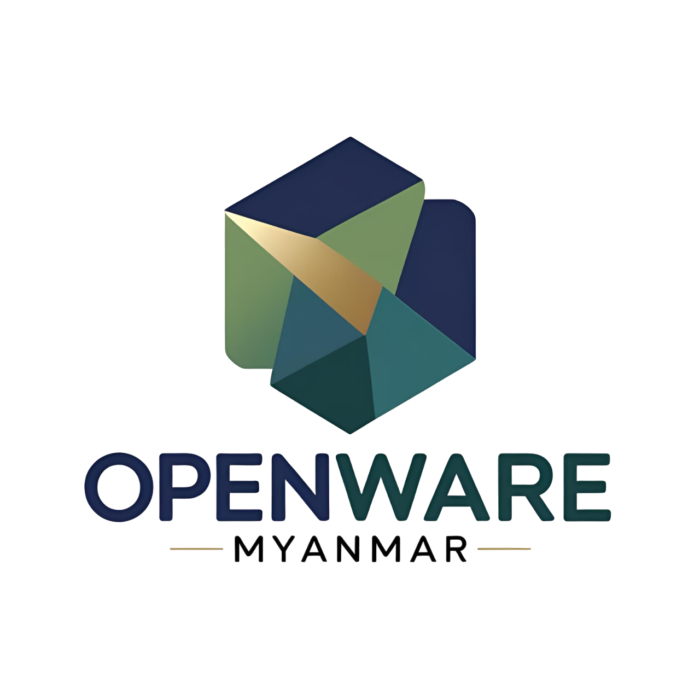

---

# Openware Stock Manager



Openware Stock Manager is a modern, intuitive, and robust Point-of-Sale (POS) inspired web application designed to streamline inventory management for businesses. Built with a powerful **Next.js** frontend and a secure **Spring Boot** backend, it leverages **PostgreSQL** and **Supabase** for efficient and scalable data management, featuring a multi-tenant architecture with single-database tenancy.

---

## Table of Contents

- [Features](#features)
- [Technologies Used](#technologies-used)
- [Architecture](#architecture)
- [Getting Started](#getting-started)
  - [Prerequisites](#prerequisites)
  - [Installation](#installation)
  - [Configuration](#configuration)
  - [Running the Application](#running-the-application)
- [Usage](#usage)
- [Deployment](#deployment)
- [Contributing](#contributing)
- [License](#license)
- [Contact](#contact)

---

## Features

- **Modern POS-style Interface:** Enjoy a clean, user-friendly design inspired by modern Point-of-Sale systems for efficient stock management.
- **Real-time Inventory Tracking:** Keep tabs on stock levels, product movements, and inventory adjustments in real-time.
- **Product Management:** Easily add, edit, and categorize products with detailed information.
- **Order Management:** Create and manage sales orders, track order status, and process transactions seamlessly.
- **User Authentication & Authorization:** Secure access with **JWT-based authentication** for various user roles.
- **Multi-Tenant Architecture:** Benefit from single database tenancy with secure data isolation for each account via unique `account_id` and JWT claims.
- **Search & Filtering:** Quickly find products and orders with powerful search and filtering capabilities.
- **Responsive Design:** Optimized for various devices, from desktops to tablets, ensuring a consistent experience.
- **Scalable Backend:** Rely on a robust **Spring Boot** backend designed for high performance and scalability.
- **Supabase Integration:** Leverage **Supabase** for seamless database interactions and extended authentication features.

---

## Technologies Used

**Frontend:**

- **Next.js:** A powerful React framework for production, offering server-side rendering (SSR) and static site generation (SSG).
- **React:** For building dynamic and responsive user interfaces.
- **Tailwind CSS (or similar CSS framework):** For rapid and consistent styling.
- **React Query (or similar data fetching library):** For efficient data fetching, caching, and synchronization.
- **Formik/Yup (or similar form libraries):** For streamlined form management and validation.

**Backend:**

- **Spring Boot:** A robust framework for building stand-alone, production-grade Spring-based applications.
- **Java:** The primary programming language.
- **PostgreSQL:** A powerful open-source relational database.
- **Supabase:** A Backend-as-a-Service providing authentication, real-time database, and more.
- **Spring Data JPA:** For easy data access with relational databases.
- **Spring Security:** For comprehensive authentication and authorization with JWT.
- **Lombok:** To reduce boilerplate code.

---

## Architecture

The Openware Stock Manager employs a microservices-inspired architecture with a clear separation of concerns:

- **Frontend (Next.js):** Manages the user interface, routing, and client-side logic. It communicates with the Spring Boot backend via RESTful APIs.
- **Backend (Spring Boot):** Provides the core business logic, data persistence, and API endpoints. It interacts directly with the PostgreSQL database.
- **Database (PostgreSQL):** Stores all application data.
- **Supabase:** Primarily used for its **authentication capabilities**, acting as an identity provider, and potentially for real-time features if integrated. The `account_id` is a crucial element in the JWT, enabling the backend to filter data for the correct tenant within the single PostgreSQL database.

**Tenant Isolation (Single DB Multi-Tenancy):**
Each customer account has a unique `account_id` embedded within the JWT upon successful authentication. All database queries made by the Spring Boot backend include a filter based on this `account_id`, ensuring strict data isolation between tenants within the same PostgreSQL database.

---

## Getting Started

Follow these instructions to get a copy of the project up and running on your local machine for development and testing.

### Prerequisites

Before you begin, make sure you have the following installed:

- **Node.js** (LTS version recommended)
- **npm** or **Yarn**
- **Java Development Kit (JDK)** (Version 17 or higher recommended)
- **Maven** or **Gradle** (for Spring Boot backend)
- **PostgreSQL** database instance
- **Supabase Account** (for authentication and other services)

### Installation

1.  **Clone the repositories:**

    ```bash
    git clone [https://github.com/aunghein-dev/openware-stock-manager-frontend.git](https://github.com/aunghein-dev/openware-stock-manager-frontend.git)
    git clone [https://github.com/aunghein-dev/openware-stock-manager-backend.git](https://github.com/aunghein-dev/openware-stock-manager-backend.git)
    ```

2.  **Frontend Installation:**

    ```bash
    cd openware-stock-manager-frontend
    npm install # or yarn install
    ```

3.  **Backend Installation:**

    ```bash
    cd openware-stock-manager-backend
    # If using Maven:
    mvn clean install
    # If using Gradle:
    ./gradlew clean build
    ```

### Configuration

#### PostgreSQL Database

1.  Create a new PostgreSQL database for Openware Stock Manager:
    ```sql
    CREATE DATABASE openware_stock_manager;
    ```
2.  Update the database connection details in the backend's `application.properties` (or `application.yml`):

    ```properties
    # openware-stock-manager-backend/src/main/resources/application.properties
    spring.datasource.url=jdbc:postgresql://localhost:5432/openware_stock_manager
    spring.datasource.username=your_pg_username
    spring.datasource.password=your_pg_password
    spring.jpa.hibernate.ddl-auto=update # or create for initial setup
    ```

#### Supabase

1.  Create a new project in Supabase.
2.  Configure your authentication settings in Supabase (e.g., enable email/password login).
3.  Obtain your Supabase Project URL and Anon Key.
4.  Update the frontend's `.env.local` file:

    ```env
    # openware-stock-manager-frontend/.env.local
    NEXT_PUBLIC_SUPABASE_URL=YOUR_SUPABASE_PROJECT_URL
    NEXT_PUBLIC_SUPABASE_ANON_KEY=YOUR_SUPABASE_ANON_KEY
    ```

5.  Configure the Supabase JWT secret in your Spring Boot backend for JWT validation. This is crucial for validating tokens issued by Supabase.

    ```properties
    # openware-stock-manager-backend/src/main/resources/application.properties
    app.jwt.supabase-secret=YOUR_SUPABASE_JWT_SECRET # Get this from Supabase project settings -> API -> JWT Secret
    ```

#### Environment Variables (General)

Ensure all necessary environment variables are set for both the frontend and backend. Refer to `.env.example` files if provided in the respective repositories.

### Running the Application

1.  **Start the Backend:**

    ```bash
    cd openware-stock-manager-backend
    # If using Maven:
    mvn spring-boot:run
    # If using Gradle:
    ./gradlew bootRun
    ```

    The backend will typically run on `http://localhost:8080`.

2.  **Start the Frontend:**

    ```bash
    cd openware-stock-manager-frontend
    npm run dev # or yarn dev
    ```

    The frontend will typically run on `http://localhost:3000`.

---

## Usage

Once both the backend and frontend are running, open your web browser and navigate to `http://localhost:3000`.

- **Sign Up / Log In:** Use the Supabase integrated authentication to create a new account or log in with existing credentials.
- **Manage Products:** Navigate to the products section to add new items, update existing ones, or view your inventory.
- **Process Orders:** Utilize the POS-like interface to create and manage sales transactions.

A preview of the application in action can be found here:

<div align="center">
  <video src="public/preview.MOV" controls width="640" height="480"></video>
</div>

---

## Deployment

Detailed deployment instructions will vary based on your chosen hosting providers.

- **Frontend (Next.js):** Can be deployed to Vercel, Netlify, or a custom server.
- **Backend (Spring Boot):** Can be deployed to Heroku, AWS EC2, Google Cloud Run, DigitalOcean Droplets, or a Kubernetes cluster.
- **Database (PostgreSQL):** Can be a managed service (e.g., AWS RDS, Azure Database for PostgreSQL, Google Cloud SQL) or a self-hosted instance.
- **Supabase:** Already a hosted service; just ensure your project is correctly configured for production.

**Key considerations for production deployment:**

- Set `spring.jpa.hibernate.ddl-auto=none` or `validate` in production for the backend.
- Configure proper CORS settings on the backend.
- Use secure environment variables for sensitive data.
- Implement robust logging and monitoring.

---

## Contributing

We welcome contributions to the Openware Stock Manager! If you'd like to contribute, please follow these steps:

1.  Fork the repository.
2.  Create a new branch (`git checkout -b feature/your-feature-name`).
3.  Make your changes and ensure they are well-tested.
4.  Commit your changes (`git commit -m 'feat: Add new feature'`).
5.  Push to the branch (`git push origin feature/your-feature-name`).
6.  Open a Pull Request.

Please ensure your code adheres to the project's coding standards.

---

## License

This project is licensed under the MIT License - see the [LICENSE](LICENSE) file for details.

---

## Contact

For any questions or inquiries, please reach out to:

- Email: [aunghein.mailer@gmail.com]
- Website: [https://app.openwaremyanmar.site](https://app.openwaremyanmar.site) (if applicable)
- GitHub Issues: [https://github.com/aunghein-dev/openware-stock-manager-frontend/issues](https://github.com/aunghein-dev/openware-stock-manager-frontend/issues)
